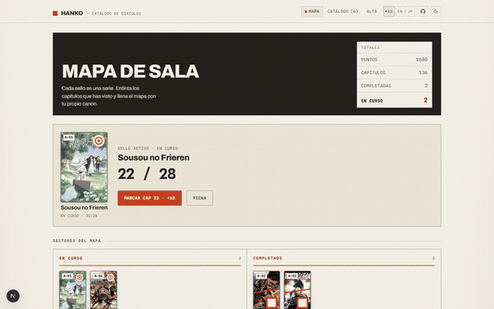
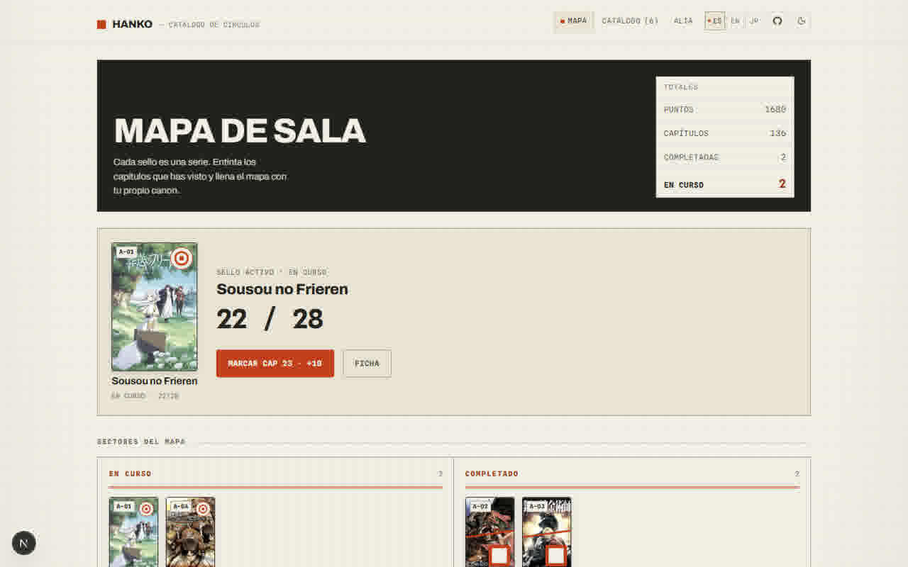
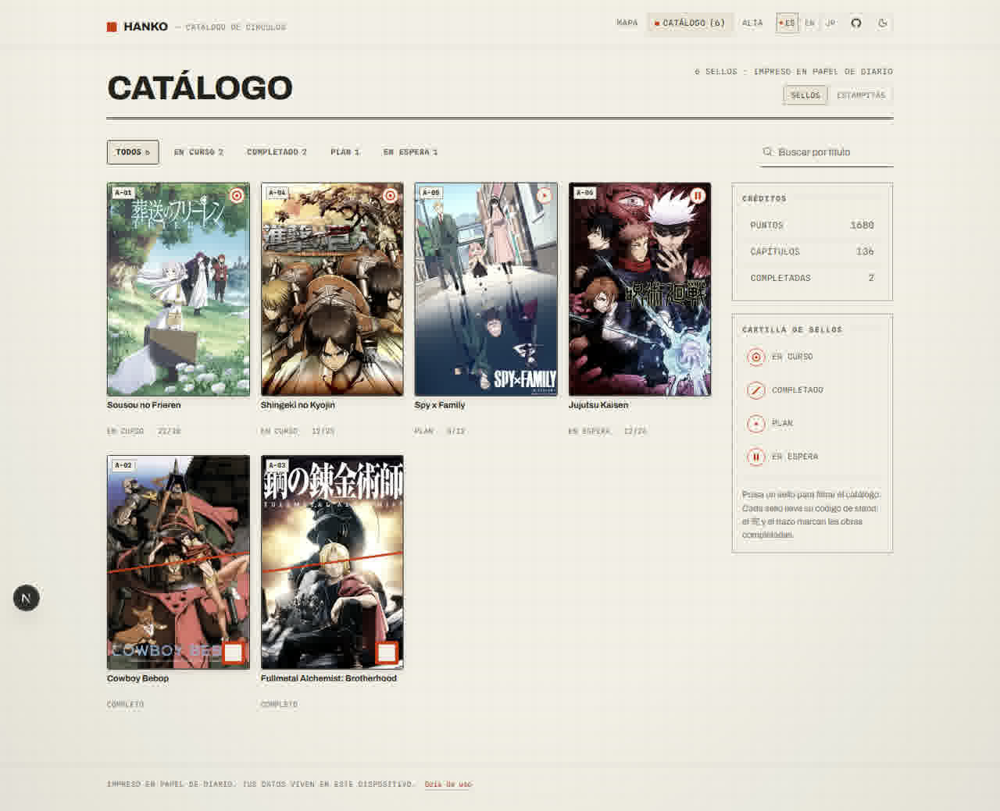
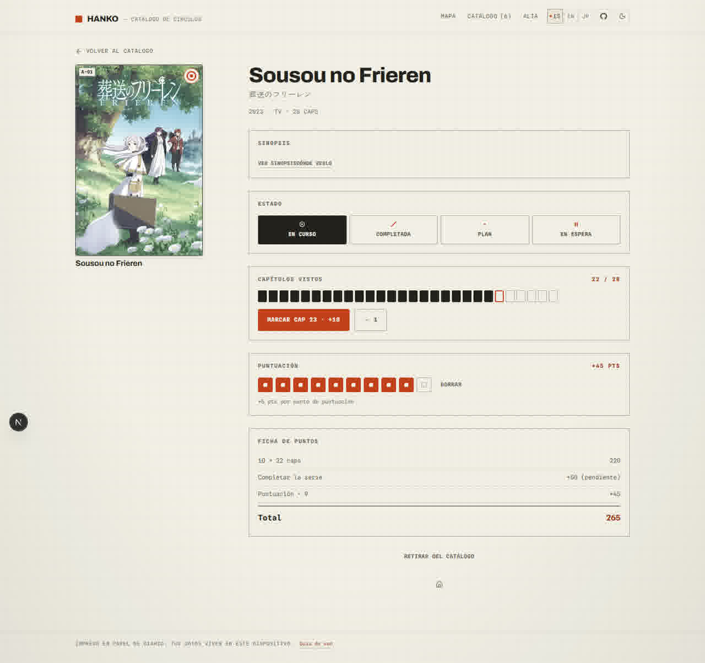
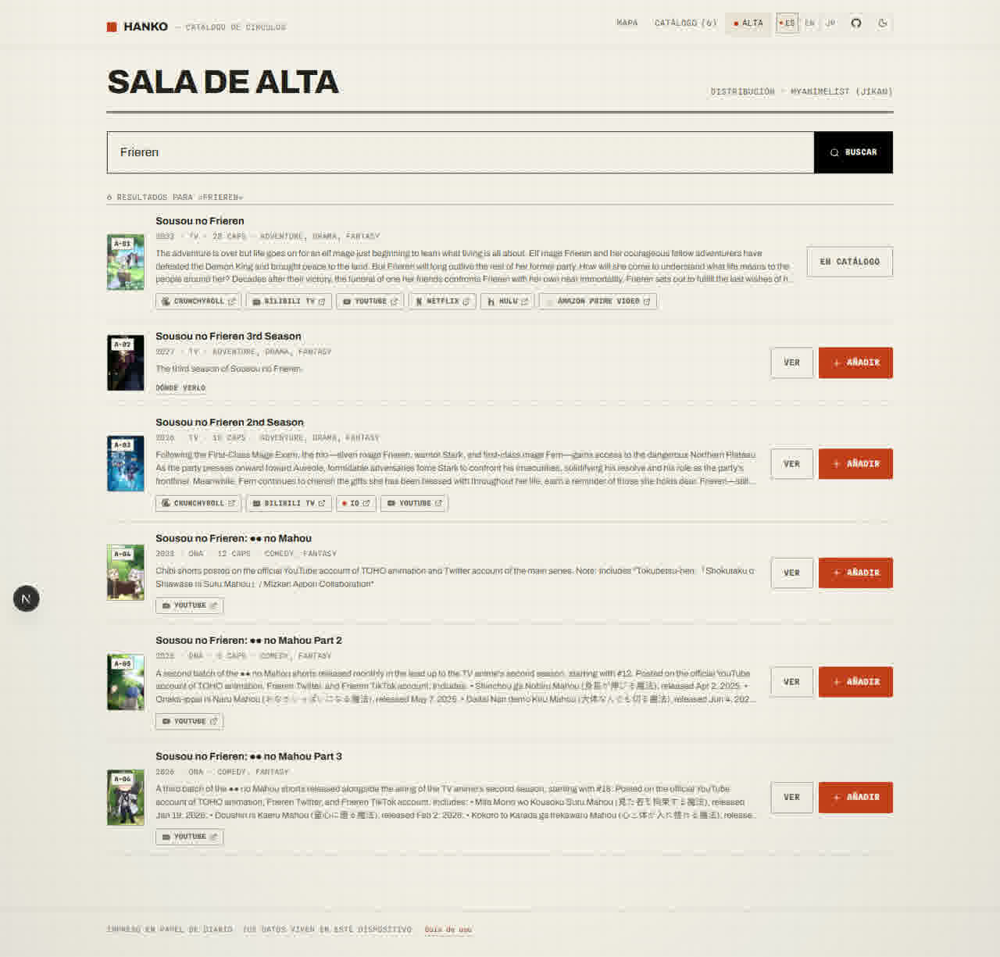
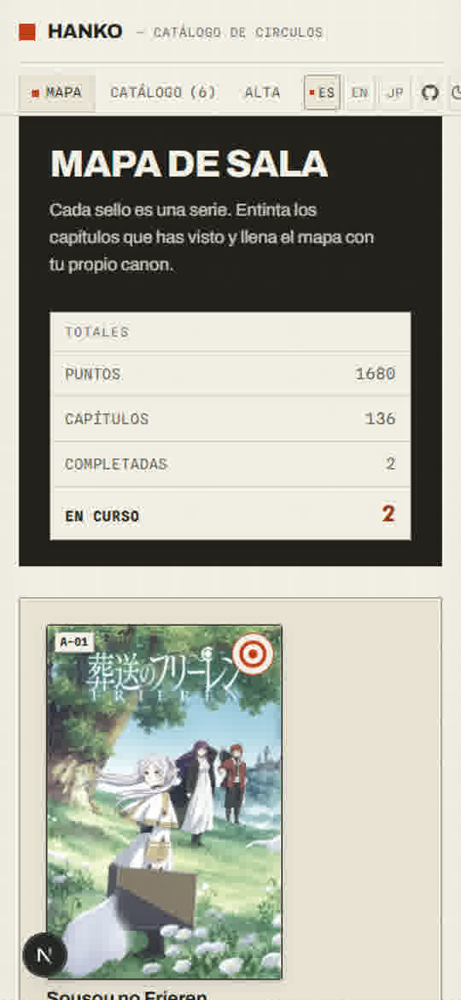

<div align="center">

<span style="display:inline-block;width:18px;height:18px;background:#c33f1b;border-radius:1px;vertical-align:middle;margin-right:10px"></span><span style="font-size:2rem;font-weight:800;letter-spacing:.06em;text-transform:uppercase;vertical-align:middle;line-height:1">Hanko</span>

<span style="display:block;margin-top:6px;font-family:ui-monospace,SFMono-Regular,Menlo,monospace;font-size:.8rem;letter-spacing:.22em;text-transform:uppercase;color:#8b949e">— catálogo de círculos</span>

<a href="https://nicolasquev.github.io/Hanko/" style="display:inline-block;margin-top:16px;padding:10px 24px;background:#c33f1b;color:#fff;border-radius:999px;font-weight:700;text-decoration:none">Abrir la web viva</a>

</div>

Tu tracker personal de anime con forma de catálogo de círculos impreso para una feria tipo comiket. Busca series, estampa tu catálogo, entinta capítulos vistos, puntúa y suma puntos — todo guardado en tu dispositivo. Sin cuentas, sin servidores.

<div align="center">



<sub style="color:#8b949e">La biblioteca se estampa en tu mapa: busca, entinta, puntúa y llena los sectores del catálogo.</sub>

</div>

## Galería

<table>
  <tr>
    <td></td>
    <td></td>
  </tr>
  <tr>
    <td></td>
    <td></td>
  </tr>
</table>

<div align="center">



</div>

## Cómo funciona

1. **Busca y reclama** — En la sala de alta buscas tu serie y la añades. Se estampa como un sello en tu catálogo.
2. **Entinta capítulos** — Cada episodio visto suma un punto. El sello activo del mapa los marca de uno en uno.
3. **Rellena la ficha** — Sinopsis, puntuación del 1 al 10 y dónde verla. Puntuar también suma puntos.
4. **Ordena el catálogo** — Los estados (en curso, completo, plan, en espera) llenan los sectores del mapa.
5. **Guarda tu progreso** — La grabadora guarda todo en un archivo (disco). Arrástralo de vuelta para recuperarlo.

La primera vez que entras, una guía te muestra este ciclo en tu idioma (ES · EN · JP).

## Stack

| Capa | Herramienta |
| --- | --- |
| Framework | Next.js (App Router) · React 19 · TypeScript |
| Animación | GSAP |
| Iconos | lucide-react |
| Datos | Jikan API / AniList GraphQL (sin API key) |
| Almacenamiento | localStorage (sin backend) |

## Empezar

```bash
npm install
npm run dev
```

Abre [http://localhost:3000](http://localhost:3000).

## Datos y privacidad

Todo se guarda en tu navegador mediante `localStorage`. Sin cuentas, sin sincronización, sin telemetría. Tus datos viven en este dispositivo.

## Diseño

El sistema de diseño completo (colores, tipografía, layout, componentes) está en [DESIGN.md](DESIGN.md).

## Licencia

[MIT](LICENSE).
